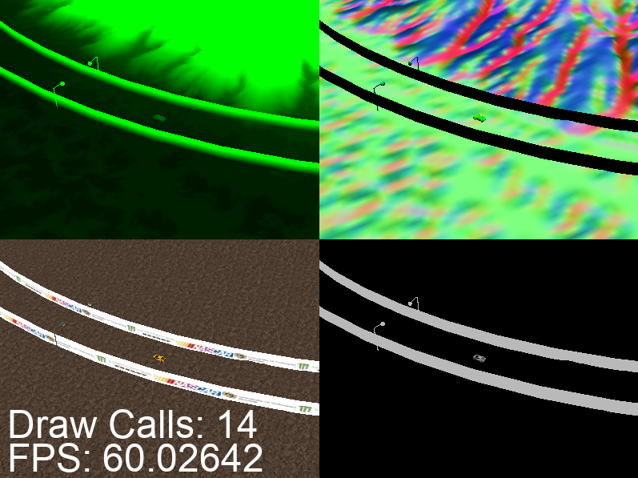
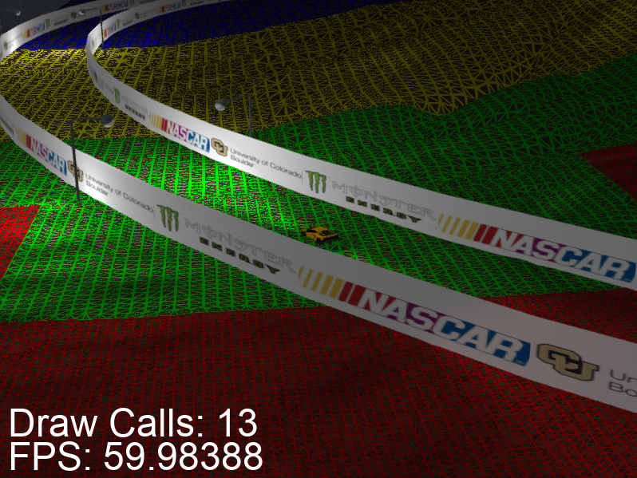
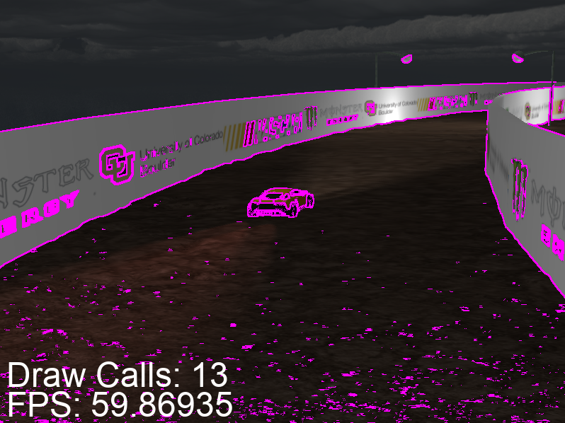
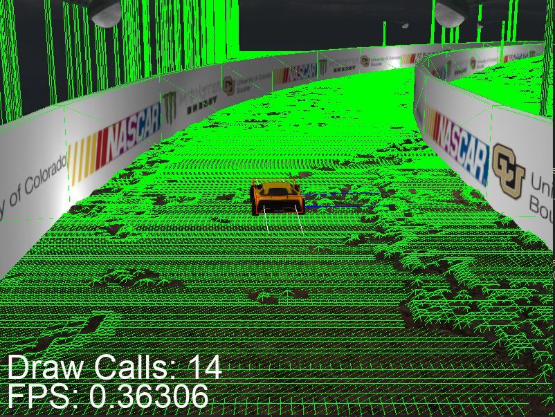

# Introduction
This is a driving scene created in OpenGL. It incorporates the Bullet physics engine,
deferred rendering, tessellated terrain, and more.

# Screenshots
The following showcases the deferred rendering capabilities:

The position texture is in the top-left, the normal texture is in the top-right, the diffuse portion of the diffuse/specular
texture is in the bottom-left, and the specular portion of the diffues/specular texture in the bottom-right.

The following showcases the tessellated terrain:

Each rendered quad in the terrain grid (pre-tessellation) is given a wireframe color based on the average
tessellation level used. The following ranges are used:
- `TL`>`30` = `red`
- `30`>`TL`>`20` = `green`
- `20`>`TL`>`10` = `yellow`
- `TL`<`10` = `purple`.

The following showcases the use of FXAA:

FXAA detects edges in the renderered scene and then blurs those edges. Here, the detected edges are highlighted in purple.

The following showcases the use of the Bullet physics engine:

The car has various debug lines, including the red AABB. The other objects in the scene have a green wireframe which represents
their collision shape.

# Build Instructions:
This project requires the following libraries:
- `libbullet-dev`
- `libassimp-dev`
- `libfreetype6-dev`
- `libglfw3-dev`
- `libglm-dev`

After installing the above, simply run `make` to build the program:
- `make`

This will create a `Build` directory, use CMake to build the project in that directory, and then
copy the executable to the topmost directory.

The program can then be run like so:
- `./opengl-driving-scene`

# Keys:
- `ESC`: Exit program
- `WASD`: Car movement
- `SPACE`: Brake
- `R`: Reset car and camera extrinsics and active forces
- `Arrow Keys`: Rotate camera around car
- `Q`/`E`: Increase/decrease distance between camera and car
- `M`: Switch between the following general rendering modes:
     * `DEFERRED` - Uses deferred rendering for regular visual output.
     * `DEBUG`    - First constructs gBuffer textures. Then displays the position texture in the top-left, the normal
                  texture in the top-right, the diffuse portion of the diffuse/specular texture in the bottom-left,
                  and the specular portion of the diffues/specular texture in the bottom-right.
- `V`: Switch between the following terrain tessellation rendering modes:
     * `DIFFUSE`               - Renders unaltered tessellated terrain.
     * `DIFFUSE_AND_WIREFRAME` - Renders wireframe of tessellated patches, along with diffuse render.
     * `WIREFRAME_ONLY`        - Renders only wireframe of the tessellated patches.
- `F`: Switch between the following anti-aliasing modes:
     * `FXAA`           - Uses FXAA post-processing shader.
     * `FXAA_AND_EDGES` - Uses FXAA post-processing shader, and draws detected edges in purple.
     * `NONE`           - Does not use any form of anti-aliasing. 
- `T`: Toggle debug draw (Bullet physics engine debug lines, as well as custom ones for light positions/directions)

# Functionality:
- Deferred rendering: The rendering pipeline is a form of deferred rendering. Moreover, the output of the intermediate geometry buffer
  textures are easily viewable using the `DEBUG` rendering mode.
- Tessellated terrain: the terrain is tessellated based off of the distance from the camera. Specifically, the outer tessellation
  level of each rectangular edge is based on the number of pixels which that edge occupies; the inner tessellation levels are
  then determined by averaging these outer tessellation levels. The approximate tessellation amounts can be viewed using the
  wireframe mode--each rendered quad in the terrain grid (pre-tessellation) is given a wireframe color based on the average
  tessellation level used. `TL`>`30` = `red`, `30`>`TL`>`20` = `green`, `20`>`TL`>`10` = `yellow`, `TL`<`10` = `purple`.
- GPU particle engine: When the gas pedal is pressed (`W`), a flame trail appears behind the car. This flame trail consists of multiple
  particle systems, each of which belong to a pre-generated pool that become active when necessary. The update step is performed using
  a compute shader and the billboarded quads are generated using a geometry shader. 
- Normal mapping (+ specular mapping): Each material has the ability to utilize a normal map and/or specular map. When these
  textures are not specified, defaults are provided to the shader (for the normal map, the default is a `1x1` blue pixel, and for
  the specular map, the default is a `1x1` gray pixel). Currently, the terrain utilizes a non-default normal map and specular map and the car
  utilizes a non-default specular map.
- FXAA: Rendering engine allows for post-processing in the form of FXAA. Moreover, the edges which are detected during this processing
  can be highlighted for debugging purposes.
- Instancing: The rendering engine aggregates material and mesh combinations; for each unique combination, it creates an
  instanced draw call which utilizes instanced arrays. This drastically reduces the total number of draw calls in the scene.
  Prior to instancing, there were `16` * `16` (for terrain) + `24` + `24` (for streetlights) + `6` (for car) = `310` draw calls for object
  rendering. Now there are `1` (for terrain) + `1` + `1` (for streetlights) + `6` (for car) = `9` draw calls for object rendering.
  Note that "object rendering" does not include draw calls for lighting pass, post-processing passes, debug lines, etc.
  In the current system, most draw calls are for the activated particle systems (although this is dependent on the number
  of active particle systems, of course).
- Bullet physics engine: each of the objects within the scene has
  an associated rigidbody. Furthermore, each of these rigidbodies have associated
  geometries used for collision detection. Specifically, the terrain uses a height
  field, the walls use a geometry generated by the underlying triangle mesh, the
  streetlights used cylinders, and the vehicle uses a compound geometry consisting
  of a box for the chassis and cylinders for the tires. Bullet provides built-in
  support for vehicle physics; as such, the results are fairly realistic.
- Asset import: The car model is imported. Importing is done using `assimp`. Rendering involves
  (1) excluding the low-poly mesh that was meant for collision detection, (2) centering
  the wheels at the mesh level (i.e., vertex position attributes) by subtracting
  the average vertex position from each vertex, and (3) obtaining the OpenGL representation
  of the model matrix from the Bullet vehicle for both the chassis and the individual
  wheels and render all of them individually.
- Custom-generated geometry: The vertex positions, normals, and texture coordinates for the streetlights and walls are
  all generated programmatically. The streetlight uses two textures (one for the post, one for the bulb), but the
  walls only use one (each "segment", which is a locally-linear approximation of the ellipse, contains one logo;
  the texture contains three logos, so each segment has a range of `1/3` in the s-coordinate).
- Debugging line drawer: The debug drawer extends the Bullet `btIDebugDraw interface`. It provides
  a simple line drawing function; this function is consumed by Bullet to draw the AABB for
  collision geometries. Moreover, I use this facility for my own purposes; right now,
  the position and direction of each spotlight and point light are shown using these debug
  lines.
- Component-based system: The project was redesigned based off of the entity-component-system (ECS) which is prevalent in
  many modern game engines like Unity and UE4.

# Acknowledgments:
- Portions of code taken from examples from [this course](http://www.prinmath.com/csci5229/Sp19/description.html) and [this website](https://learnopengl.com/).
- FXAA shader is a modified version of the one [found here](https://github.com/McNopper/OpenGL/blob/master/Example42/shader/fxaa.frag.glsl).
- None of the artwork is mine.
